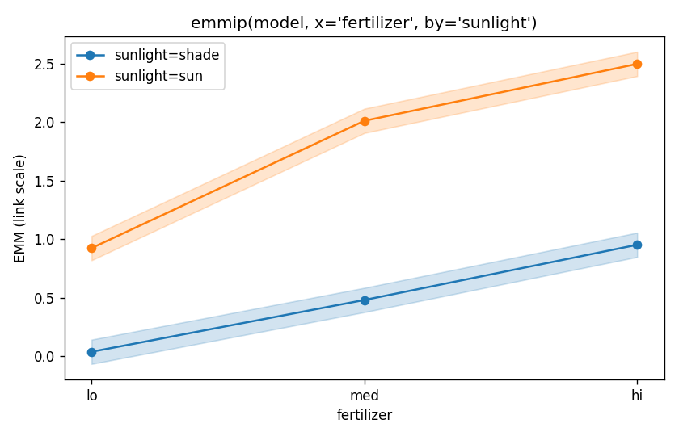

# Getting started

## Install

```bash
pip install pymmeans                                          # core
pip install "pymmeans[plot]"                                  # + matplotlib
pip install "pymmeans[plot,parallel,tutorial]"                # everything
```

For local development:

```bash
git clone https://github.com/jturner-uofl/pymmeans.git
cd pymmeans
uv venv && uv pip install -e ".[dev,plot,docs]"
```

## A worked example

```python
import numpy as np
import pandas as pd
import statsmodels.formula.api as smf
from pymmeans import emmeans, pairs, contrast, plot

# Synthetic dataset (3 fertilizer × 2 sunlight, n=180)
rng = np.random.default_rng(0)
df = pd.DataFrame({
    "fertilizer": np.tile(np.repeat(["lo", "med", "hi"], 30), 2),
    "sunlight":   np.repeat(["shade", "sun"], 90),
})
df["growth"] = (
    df["fertilizer"].map({"lo": 0.5, "med": 1.2, "hi": 1.8})
    + (df["sunlight"] == "sun") * 0.4
    + rng.normal(0, 0.3, 180)
)
model = smf.ols("growth ~ fertilizer * sunlight", data=df).fit()

emm = emmeans(model, "fertilizer")
print(emm)
# EMMs of fertilizer on link scale, 95% CI
#   fertilizer    emmean       SE     df  lower_cl  upper_cl
# 0         hi   2.0071   0.0376  174.0    1.9328    2.0813
# 1         lo   0.6811   0.0376  174.0    0.6069    0.7554
# 2        med   1.4399   0.0376  174.0    1.3657    1.5142

# Pairwise comparisons, Tukey-adjusted
print(pairs(emm))
# 3 contrasts (adjust=tukey)
#    contrast  estimate      SE     df  t_ratio   p_value
# 0   hi - lo    1.3259  0.0532  174.0   24.92   < 1e-9
# 1  hi - med    0.5671  0.0532  174.0   10.66   < 1e-9
# 2  lo - med   -0.7588  0.0532  174.0  -14.26   < 1e-9

# Conditional EMMs and forest plot
ax = plot(emmeans(model, "fertilizer", by="sunlight"))

# Treatment-vs-control contrasts
contrast(emm, method="trt.vs.ctrl", ref="lo")

# Polynomial / consecutive contrasts for ordered factors
contrast(emm, method="poly")
contrast(emm, method="consec")
```

## Response-scale GLM

```python
import statsmodels.api as sm
fit = smf.glm("pain ~ treatment * sex + age", data=df, family=sm.families.Binomial()).fit()
# Probabilities (not logits) with delta-method SEs
print(emmeans(fit, "treatment", type="response"))
```

## Mixed-effects models

```python
mlm = smf.mixedlm("y ~ group + x", data=df, groups="subject").fit()
print(emmeans(mlm, "group"))   # Wald z-tests (df = inf)
```

For finite-sample inference, swap in Satterthwaite or Kenward-Roger
degrees of freedom:

```python
from pymmeans import apply_satterthwaite, apply_kenward_roger
emm = emmeans(mlm, "group")
emm_satt = apply_satterthwaite(emm)       # any RE structure
emm_kr   = apply_kenward_roger(emm)       # inflated vcov + Satt df
print(emm_kr.frame[["group", "SE", "df", "lower_cl", "upper_cl"]])
```

`apply_satterthwaite` matches lmerTest's df to within numerical
tolerance. `apply_kenward_roger` is currently flagged experimental: it
agrees with `pbkrtest` on non-intercept coefficients but the intercept
SE diverges by ~5% on our reference fit — see the function's docstring
for the open issue.

## Panel regression with linearmodels

```python
from linearmodels import PanelOLS
from pymmeans import from_linearmodels, emmeans

# Note: include explicit '1 +' so linearmodels uses treatment coding
fit = PanelOLS.from_formula("y ~ 1 + x + g", panel_df).fit()
info = from_linearmodels(fit, data=raw_df)
print(emmeans(info, "g"))
```

## Joint tests (Type III ANOVA)

```python
from pymmeans import joint_tests
print(joint_tests(model))
#   term  df_num  df_denom  statistic   p_value
# 0    a       1     174.0      45.21  2.3e-10
# 1    b       2     174.0      88.04  4.5e-26
# 2  a:b       2     174.0      12.30  9.1e-06
```

## Plot interaction effects

```python
from pymmeans import emmip
emmip(model, x="fertilizer", by="sunlight")
```



## Bootstrap CIs

```python
from pymmeans import bootstrap_ci
boot = bootstrap_ci(emmeans(fit, "treatment", type="response"),
                    n_samples=5000, seed=0)
```

Natural for response-scale binomial intervals where Wald CIs can fall
outside [0, 1] or be uninformatively wide.

## Next

- [API reference](api/emmeans.md) — full signatures and parameter docs
- [vs R emmeans validation](vs-r.md) — what we match, what we don't
- [Performance](PERFORMANCE_REPORT.md) — benchmark numbers
- [v0.2 roadmap](v0_2_roadmap.md) — what's planned next
